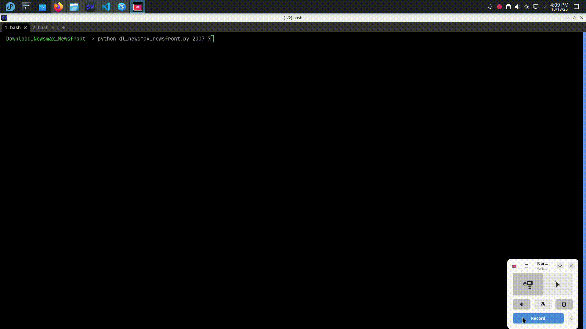

# Download Newsmax Newsfront

Technologies used: *Python*
&nbsp;

This is a web scrapper that downloads all new articles from the "newfront" archive of ```www.newsmax.com```.

Things that I learned while building the project:

- If continual requests are made the site blocks the connecting IP. Connecting to the site using a proxy (ScrapeOps) was needed. Using backoff/retry and custom User Agent strings/headers did not circumvent the eventual IP block.
- I originally copied each article's data to a "row" list before writing to a .CSV. Later I tried ```row.append()``` to create a batch of data that was then written to a .CSV. The program currently doesn't support picking up from the point of when the last article was saved and I don't need to perform any further manipulation of the data before saving so copying to a list is unnecessary. Instead the data is sent directly to the function that writes to a .CSV.
  
  ```row.append()``` would have allowed the articles to be better written in chronological order by year/month in the .CSV by the threads but it isn't necessary as the database will be used to sort the rows anyway. It also uses more memory and I wanted to use as less as possible as I wanted to run the program on a Raspberry Pi.
- I also tried writing the articles to a queue, pulling from the queue and then writing to .CSV to avoid having to use thread locks (csvwriter isn't thread-safe.) However I had problems using threads with the queue as "queue.put()" only pulls one item at a time and isn't designed to write data all on one line (in retrospect I may have been able to get around this by utilizing the csvwriter ```writerow()``` method as currently used in the program.)
&nbsp;

Program can be run using:

Export ```SCRAPEOPS_API_KEY``` environment variable.

- Example:
  
  ```export SCRAPEOPS_API_KEY=11111111-2222-3333-4444-555555555555```

Then:

    python dl_newsmax_newsfront.py <YYYY year of archive> <MM month of archive>
    
- Example:

    ```python dl_newsmax_newsfront.py 2007 7```


## Demo

